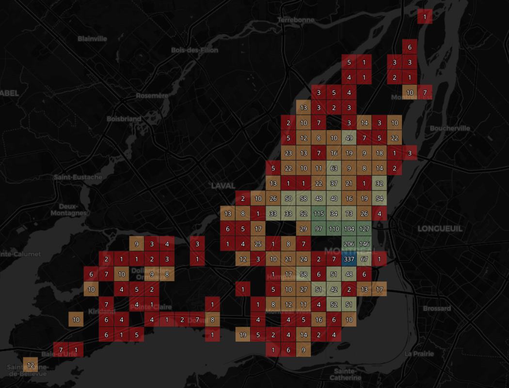
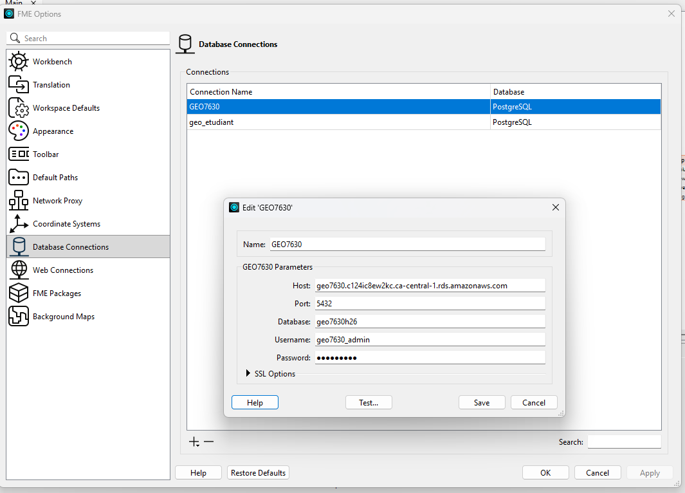

# Examen #1 - GEO7630H25
 
##  Date & Heure
**10 mars 2026** - 🕠 **17h30**  
**Salle A-4160** - **UQAM**  
**Chargé de cours** : Clément Glogowski  
 
---
 
## **Première Partie - Examen Théorique 50%**
L’examen théorique se déroule via un **formulaire en ligne**.  
**⚠️ Ce formulaire doit être complété pendant la période de l’examen et remis avant 20h30 (la réponse sera postdatée)**
 
🔗 **Accès au formulaire :**  
👉 [Formulaire d'examen (Google Forms)](https://forms.gle/nhA8gsRuCRDHMuTq8)
 
---
 
## 🛠 **Deuxième Partie - Micro TP FME 50%**
Vous devrez **Créer une couche d’indexes polygonaux** représentant la quantité de commerces vacants dans chacun des polygones.
 
### **📥 Données entrantes**
 
1️⃣ **Couches des commerces (GeoJSON)**  
🔗 [Occupation commerciale 2024 - Montréal](https://donnees.montreal.ca/dataset/f8582c4d-a933-4306-bb27-d883e13dd207/resource/9f30f407-e21f-4b19-aa78-ef5244a9aca7/download/occupation-commerciale-2025.geojson)
 
2️⃣ **Limites terrestres (GeoJSON) pour créer les hexagones**  
🔗 [Limites terrestres - Montréal](https://data.montreal.ca/dataset/b628f1da-9dc3-4bb1-9875-1470f891afb1/resource/92cb062a-11be-4222-9ea5-867e7e64c5ff/download/limites-terrestres.geojson)
 
---
 
## **🔍 Requis du TP**
✅ Filtrer les commerces vacants **sur la propriété `VACANT`**.

✅ Créer des points à partir des données filtrées

✅ Créer une grille de polygones basée sur la géométrie des limites terrestres **avec le transformer **2DGridAccumulator**.

    - Laissez les options par défaut seul les propriétés column_width et row_height doivent être configuréea à 2000

✅ **Faire la jointure spatiale entre les polygones et les points de commerces pour compter le nombre de commerces qui se trouvent dans une unité de la grille**.

✅ **Écrire les hexagones dans la base de données PostgreSQL/PostGIS**.

✅ **Créer une carte QGIS, choisir la symbologie désirée et faire un README.md très simple avec un screenshot de votre carte ainsi que votre projet QGIs (.qgz)**

L'image ci-dessous est à titre de référence. Vous pouvez choisir la symbolige qui vous semble appropriée pour représenter ce phénomène.

⚠️ **Indice 1:** Le polygone contenant le plus de commerces vacants en possède **337**.

---
 
## 🗄 **Connexion à la base de données**
Votre **Writer PostgreSQL** devra enregistrer les hexagones dans la base de données suivante :
 

| **Paramètre** | **Valeur** |
|--------------|-----------|
| **Nom de la base** | `geo7630h26` |
| **Host** | `geo7630.c124ic8ew2kc.ca-central-1.rds.amazonaws.com` |
| **Port** | `5432` |
| **Database** | `geo7630h26` |
| **Username** | `VOTRECODEMS` |
| **Password** | `VOTREMOTDEPASSE` |
| **Nom du Schéma** | `VOTRECODEMS` |
| **Nom de la Table** | `VOTRECODEMS_EXAM1` |
 
📌 **⚠️ Table qualifier :** `VOTRECODEMS`
 
---

 ⚠️ **Information utile:** Si vous ne trouvez pas 337, ou n'arrivez pas à finir le workbench sauvegarder les progrès en cours dans votre workbench et mettez le dans votre dépôt github dans le dossier Exam 1

## 🛑 **Pièges et conseils**
⚠ **Attention aux erreurs classiques :**  
🔹 Vérifiez / reprojetez vos données correctement (indice : 3857)
🔹 Assurez-vous que votre **connexion PostgreSQL** fonctionne avant la fin de l’examen.  
🔹 Vérifiez vos **résultats** : le nombre d’hexagones et de commerces vacants doit être **cohérent** avec les données en entrées.
 
---
 
🚀 **Bonne chance à tous !**